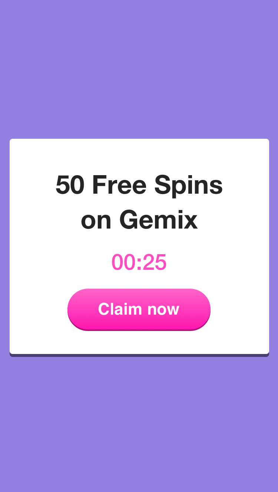
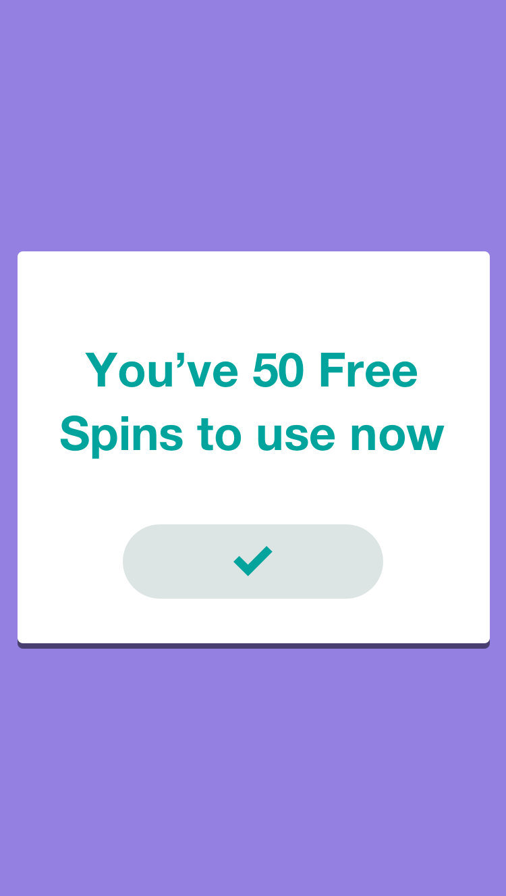

# Shift Tech Assessment

#### Tasks
* [X] Fetch all data via ajax call
* [X] Mobile Initial Display (Unclaimed)
* [X] Desktop Initial Display (Unclaimed)
* [X] Mobile Display (Claimed)
* [X] Desktop Display (Claimed)
* [X] Responsive Display
* [X] Prevent claiming bonus when timer runs out
* [X] Countdown in format 'mm:ss' when time remaining is less than an hour
* [X] Countdown in format 'hh:mm:ss' when time remaining is more than an hour
* [X] Countdown hides once the user claims
* [X] Countdown hides if expiry is in the past
* [X] Claim now button changes to "Expired" if expiry is in the past

##### Additional Tasks
* [ ] `npm run lint` all passing
* [ ] `npm run test` all passing

##### Known issues
* [ ] Countdown longer than 24hrs displays a misleading countdown without "days remaining"

##### Notes:
* AJAX data can be found in the [./src/assets/json](./src/assets/json/promotions-1.json) folder
* The countdown timer is based off the `expiry` property in the json file
* The CTA text can be changed in the json file 
* Tried to find the closest match of fonts for `HelveticaNeue-Bold` and `Helvetica-Bold`
* Fonts can be found in the [./src/assets/styles](./src/assets/styles) folder
* Did not write any additional tests apart from the ones that come out of the box

---

## Original Spec

Instructions for the Front-End Development Test
 
We would like you to take a UI design and convert it into responsive HTML layout.
The screen that we would like you to build shows a temporary bonus that players can claim.
 
The amount (50), prize (Free Spins), game (Gemix) and countdown (25 secs) are dynamic and should come from an ajax call.
 

 
When a player clicks on Claim Now they should see the following screen.

 
Again, the prize should be dynamic with the value from last screen.

---
 
In the zip file provided you will find an HTML file named index.html open this in your browser to find the interactive design specification for the screen we would like you to build.
 
The HTML file will allow you to click on any of the screen elements and in the right panel you will be able to see measurements, styles, fonts, colours etc to guide you in building the screen.
 
You will notice there are 4 layouts screens on the left:
 
1. Desktop claim screen
2. Desktop success screen
3. Mobile claim screen
4. Mobile success screen
 
What we need you to do is the following:
 
- The implementation of the 4 screens specified in the file index.html.
- The Screen must be responsive.
- The information for the bonus must come from a JSON via Ajax.
- The style sheets must be developed using SASS.
 
Tips:
 
- The JSON with the information must be created by you. A static file with sample data is enough.
- The use of Angular is mandatory, if you do not use it, the test won’t be evaluated.
- The use of SASS is mandatory, if you do not use it, the test won’t be evaluated.
- The use of frameworks such Boostrap our Foundation is recommended.
 
Good luck.
